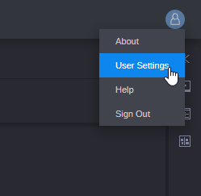
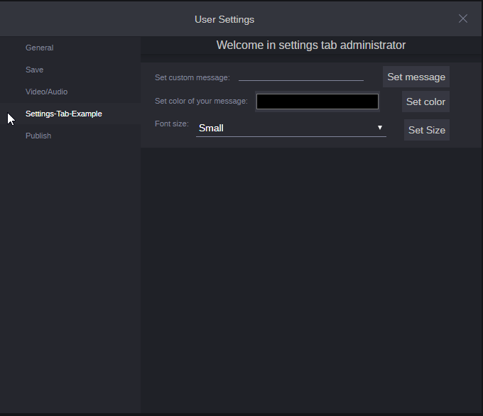
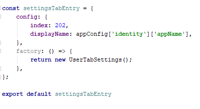
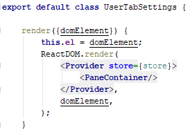
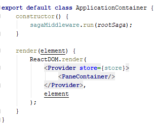

# Example Settings Tab

## Introduction

This example show how can you use settings tab in Avid MediaCentral | Cloud UX.

## Settings Tab
To add settings tab follow [guide](http://developer.avid.com/mcux_ui_plugin/clux-api/settings/system-settings-api.html "Avid Developers").
Settings tab allow you to put your application in **User Settings**.
To see it just click on your avatar and select **User Settings**

In this example in your User Settings window you can see**Settings-Tab-Example**.

From here you can change **message** that is displayed in Application,
**color** and **size** of it.

##### Change Tab
If you want to change tab you can do it in
[settingsTabEntry](src/avid_api/settings-tab/settingsTabEntry.js "Settings Tab").
**index** will change positions of your tab, **displayName** will change
displayed name of your tab.

**If** you want to change Settings Tab you can do it in
[UserTabSettings](src/avid_api/settings-tab/UserTabSettings.js "User Tab Settings").

**If** you want to change Application you can do it in
[Main View](src/app/indexMainView.jsx "User Tab Settings").

## Running the example

To run example you will need Avid MediaCentral | Cloud UX server. Properties
can we changed in [src/project.act](src/project.act "Project act").
After you change hostIp in `project.act` you can run application.

**from cli type:**
1. `npm install`
2. `npm start`
3. Go to your [127.0.0.1:8080](https://127.0.0.1:8080/ "127.0.0.1:8080").

